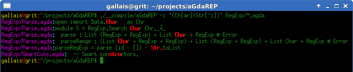

# aGdaREP - Implementing grep in Agda

```
Usage: aGdaREP [OPTIONS] PATTERN [FILENAME]

OPTIONS:
  -h  Print this help
  -V  Version
  -v  Invert the match
  -i  Ignore case
```




Requirements
------------

This project should compile using:

* Agda version 2.6.1
* The standard library (dev version)
* [Agdarsec](https://github.com/gallais/agdarsec) (dev version)


Implementation details
----------------------

The matching algorithm is more or less the one described in Alexandre Agular
and Bassel Mannaa's 2009 technical report ([pdf](http://itu.dk/people/basm/report.pdf)).
I depart from it in two occasions:

* firstly, I use smart constructors rather than having a later pass simplifying
  the regular expression computed by the derivative function `_⟪_` (called `eat` here);


* and secondly I replace the notions of the empty language and the language of all
  one letter long words by the more general idea of ranges ("any of" and "any but").
